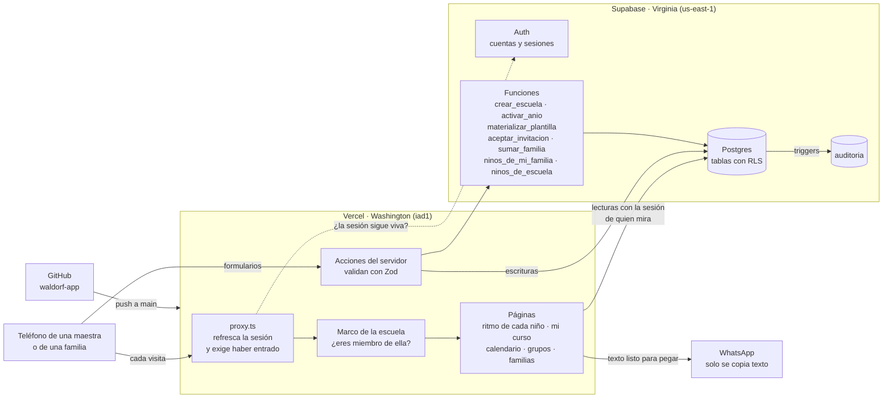
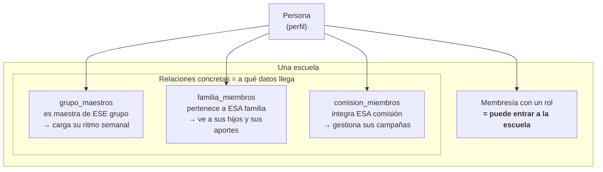
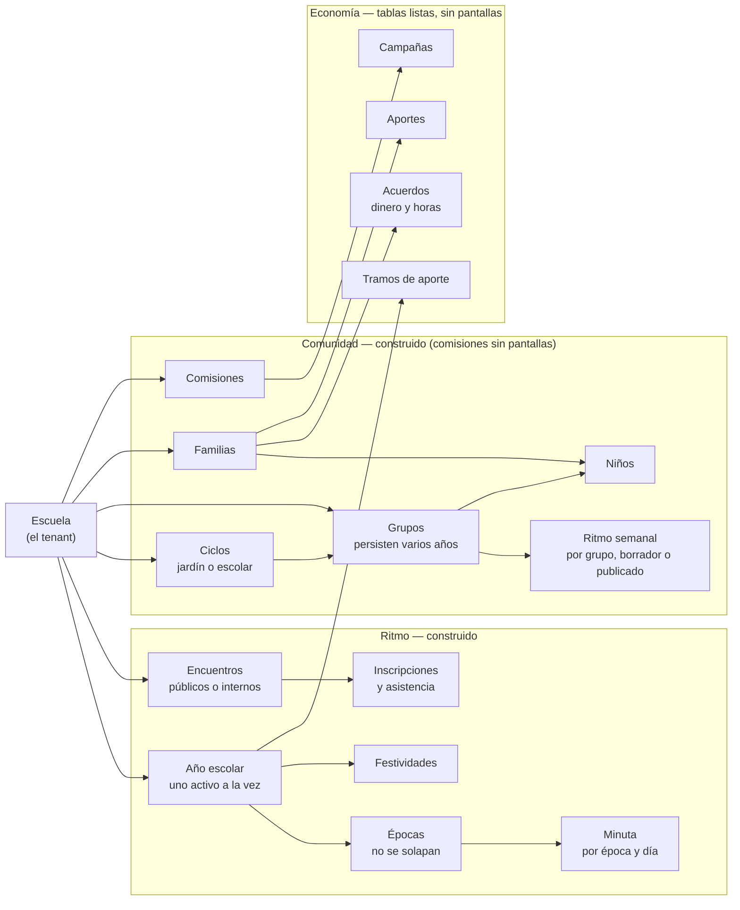
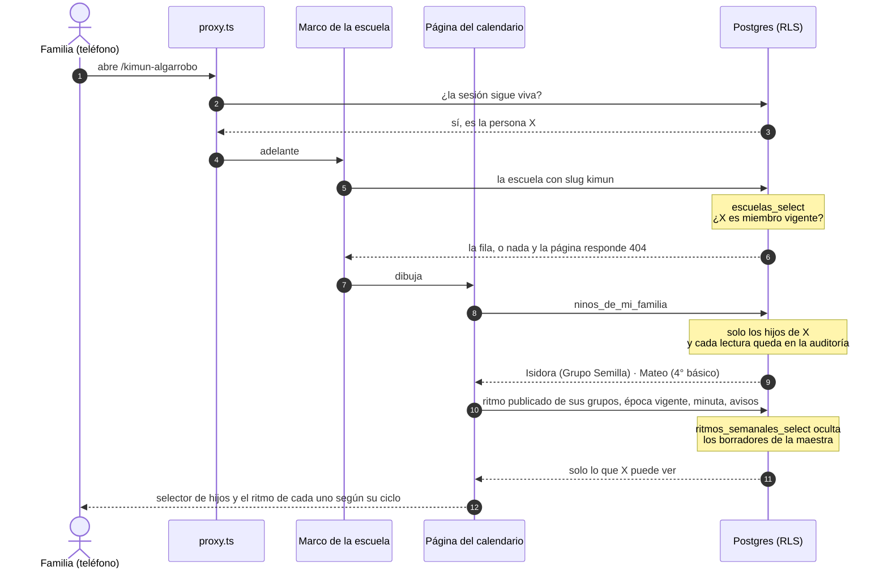
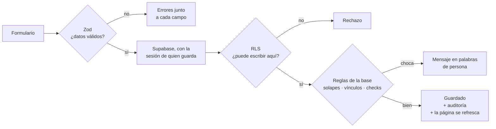
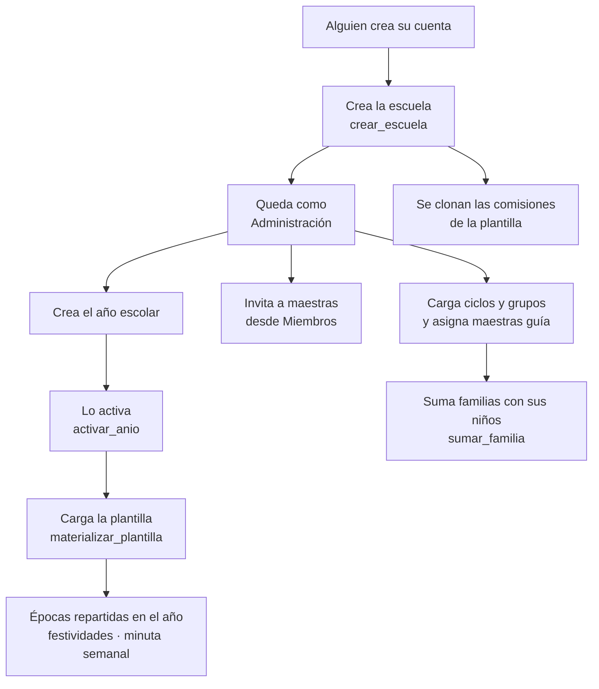
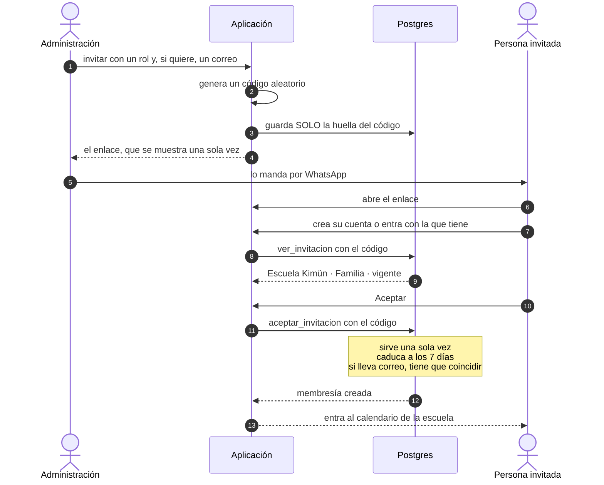
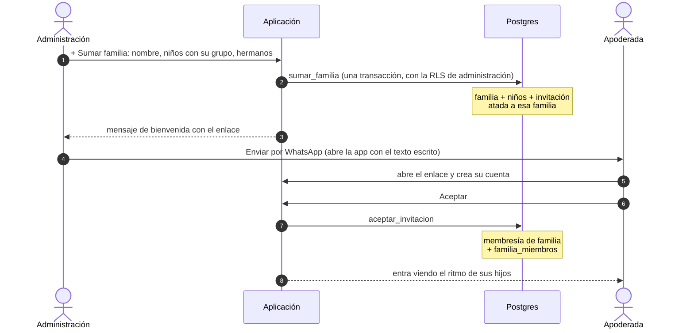

# Mapa del sistema

Cómo está construida la aplicación y cómo conviven dentro de ella una escuela, sus
maestras, sus familias y sus comisiones.

Este documento describe **lo que está construido y desplegado hoy**, no lo que está
planeado. Para el modelo completo del dominio, ver `DOMAIN.md`; para el orden de
construcción, `ROADMAP.md`.

---

## 1. Las piezas y por dónde viaja la información

**La idea central:** la aplicación nunca decide qué datos puede ver cada persona. Cada
consulta viaja a Postgres **con la sesión de quien mira**, y es Postgres —con sus
políticas de RLS— el que devuelve solo las filas permitidas. Un error en el código de la
aplicación no puede mostrar datos de otra escuela, porque el filtro no está ahí.

**WhatsApp es solo salida.** La aplicación genera textos para pegar en los grupos de la
comunidad; nunca lee ni guarda mensajes de WhatsApp.

---

## 2. Cómo convive la gente dentro de una escuela

Una persona existe **una sola vez** en el sistema (su *perfil*), aunque pertenezca a varias
escuelas. Lo que la conecta con cada escuela son dos cosas distintas, y conviene no
confundirlas:

- **El rol dice qué es la persona en la escuela.** Administración, colegio de maestros,
  maestro guía, maestro de especialidad, comisión, familia. Una misma persona puede tener
  varios: una maestra que además es madre tiene dos membresías.
- **Las relaciones dicen a qué datos concretos llega.** Invitar a alguien como *maestro
  guía* le abre la escuela, pero **no le muestra ningún niño** hasta que se la asigna a un
  grupo. Invitar a alguien como *familia* le abre el calendario, pero no le muestra a sus
  hijos hasta que se la vincula a su familia. Por eso "Sumar familia" crea la invitación
  **ya atada a la familia**: al aceptarla, la persona queda en `familia_miembros`.

Esto es deliberado: el acceso a datos de niños nunca se deduce de una etiqueta, siempre de
un vínculo explícito y con vigencia.

### La escuela y sus datos

Todas estas tablas llevan la columna `escuela_id`, y **cada vínculo entre ellas exige que
las dos filas sean de la misma escuela** (llaves foráneas compuestas). Es imposible, a nivel
de base de datos, que una época de una escuela cuelgue del año de otra.

---

## 3. Quién ve y quién cambia qué

Leído de las políticas de seguridad aplicadas hoy en producción.

✏️ lee y cambia · 👁️ solo lee · 🔸 solo lo suyo · — nada

| Dato | Administración | Colegio de maestros | Maestras | Familia |
|---|:-:|:-:|:-:|:-:|
| Datos de la escuela | ✏️ | ✏️ | 👁️ | 👁️ |
| Años, épocas, festividades, minuta | ✏️ | ✏️ | 👁️ | 👁️ |
| Encuentros públicos | ✏️ | ✏️ | 👁️ | 👁️ |
| Encuentros internos del equipo | ✏️ | ✏️ | — | — |
| Inscribirse a un encuentro | 🔸 | 🔸 | 🔸 | 🔸 |
| Ciclos, grupos y sus maestras | ✏️ | ✏️ | 👁️ | 👁️ |
| Ritmo semanal en borrador | ✏️ | ✏️ | ✏️ de su grupo | — |
| Ritmo semanal publicado | ✏️ | ✏️ | ✏️ de su grupo, 👁️ el resto | 👁️ |
| Comisiones y sus integrantes | ✏️ | ✏️ | 👁️ | 👁️ |
| Campañas | ✏️ | ✏️ | 👁️ ¹ | 👁️ ¹ |
| Miembros de la escuela | ✏️ | 👁️ | 🔸 | 🔸 |
| Invitaciones | ✏️ | — | — | — |
| Familias | ✏️ | 👁️ ² | — | 🔸 |
| Niños | ✏️ | 👁️ ² | 🔸 de su grupo | 🔸 sus hijos ³ |
| Tramos de aporte | ✏️ | 👁️ | 👁️ | 👁️ |
| Acuerdos y aportes | ✏️ | — | — | 🔸 |
| Auditoría | 👁️ | — | — | — |

1. Quien integra una comisión puede además gestionar las campañas de **esa** comisión. Lo
   da la relación `comision_miembros`, no el rol.
2. Ver la sección 7: esto no calza con `PRIVACY.md`.
3. La aplicación no lee `ninos` directo: pasa por `ninos_de_mi_familia` (solo los hijos de
   quien pregunta) y `ninos_de_escuela` (todos, solo administración). Las dos dejan cada
   lectura en la auditoría, como exige el nivel Menor.

Además, **cualquier persona con cuenta puede crear una escuela nueva**, y queda como su
administración. Es el único punto del sistema que se salta la RLS, a propósito.

---

## 4. Qué pasa cuando alguien abre la aplicación

Si X no pertenece a la escuela, la respuesta es **404, no 403**: quien no es miembro no
tiene por qué saber siquiera que esa escuela existe.

Quien no tiene hijos en la escuela (el equipo) ve en la portada el calendario, que para
todos vive además en `/calendario`.

### El ritmo según el ciclo

El ciclo del grupo (`ciclos.modalidad`) decide qué ve la familia. Los nombres ("Grupo
Semilla", "Básica") son de cada escuela; la modalidad es la diferencia pedagógica real.

| | Jardín (primer septenio) | Escolar (básica y media) |
|---|---|---|
| Arriba | Cuento, ronda o arquetipo de la semana | Época activa con su avance (semana 2 de 4) y tema de la semana |
| Cada día | Cereal y actividad | Cereal, clase principal y materias especiales |
| Abajo | Qué llevar y recordar | Materiales, recordatorio y avisos del curso |
| Nunca | Asignaturas, épocas académicas | — |

El cereal del día sale de la minuta de la época, salvo que la maestra escriba otro.

## 5. Qué pasa cuando alguien guarda algo

Las reglas del dominio las hace cumplir la base de datos (que dos épocas no se solapen,
que haya un solo año activo, que un vínculo no cruce de escuela). La aplicación solo
traduce el rechazo a un mensaje que una maestra entienda; **nunca muestra el error crudo
de Postgres**.

---

## 6. La vida de una escuela

### El alta y el año

La plantilla (`supabase/seed/plantillas/kimun-cl.json`) es **dato, no código**: cuántas
épocas hay y cómo se llaman, qué festividades se celebran, qué comisiones existen. Cada
escuela parte de ella y la ajusta.

### Invitar a alguien

No enviamos correos: la administración recibe un **enlace** y lo manda por WhatsApp,
que es donde la comunidad ya vive.

- La base guarda **la huella del código, nunca el código**. Aunque alguien leyera la tabla,
  no podría usar una invitación.
- Si la administración pone un correo, solo quien entre con **ese** correo puede aceptarla.
  Sin correo, la acepta quien tenga el enlace: conviene no mandarlo a un grupo abierto.
- `aceptar_invitacion` es el segundo punto que se salta la RLS, y por la misma razón que
  `crear_escuela`: quien acepta todavía no es miembro y no podría crearse la membresía.

### Sumar una familia

Cada enlace sirve a una sola persona. El segundo apoderado recibe el suyo desde la tarjeta
de la familia ("Invitar a alguien más").

### Publicar el ritmo de la semana

La maestra abre **Mi curso**, toca cada día para cargarlo (panel lateral) y pulsa
**Publicar ritmo para familias**. Antes de publicar es un borrador que solo ven ella y los
gestores. Después, la aplicación deja listo el resumen para mandarlo al grupo de WhatsApp
del curso: no enviamos notificaciones, integramos con lo que la comunidad ya usa.

---

## 7. Discrepancias detectadas al hacer este mapa

Cosas que el sistema hace hoy y que no calzan con `PRIVACY.md`. No están corregidas.

| # | Qué pasa hoy | Qué dice `PRIVACY.md` |
|---|---|---|
| P1 | El **colegio de maestros ve todas las familias y todos los niños** de la escuela, porque las políticas usan `es_gestor`, que incluye al colegio. | Niños (nivel Menor): administración, maestro **del grupo** y su familia. Familias (nivel Personal): administración y el propio titular. |
| P2 | **Cualquier miembro puede leer nombre, correo y teléfono de todos los demás miembros** de su escuela (`perfiles_select_companeros`). Una familia puede ver el teléfono de otra. | Datos personales: administración y el propio titular. |

Ninguna de las dos se ve hoy en pantalla —la página de Familias es solo de administración,
y la aplicación lee niños únicamente por las funciones auditadas—, pero sí son accesibles a
través de la API con una sesión válida. Conviene corregirlas antes de cargar datos reales de
familias.

---

## 8. Qué está construido

| Módulo | Base de datos | Pantallas |
|---|:-:|:-:|
| Tenencia: cuentas, escuelas, membresías | ✅ | ✅ |
| Invitaciones | ✅ | ✅ |
| Ritmo: año, épocas, festividades, minuta, encuentros | ✅ | ✅ |
| Ritmo semanal por grupo y vista por niño | ✅ | ✅ |
| Comunidad: ciclos, grupos, familias, niños | ✅ | ✅ |
| Comunidad: comisiones | ✅ | — |
| Economía: acuerdos, aportes, campañas | ✅ | — |
| Desarrollo: observaciones, informes | — | — |
| Privacidad: consentimientos, derechos del titular | auditoría de escrituras | — |
